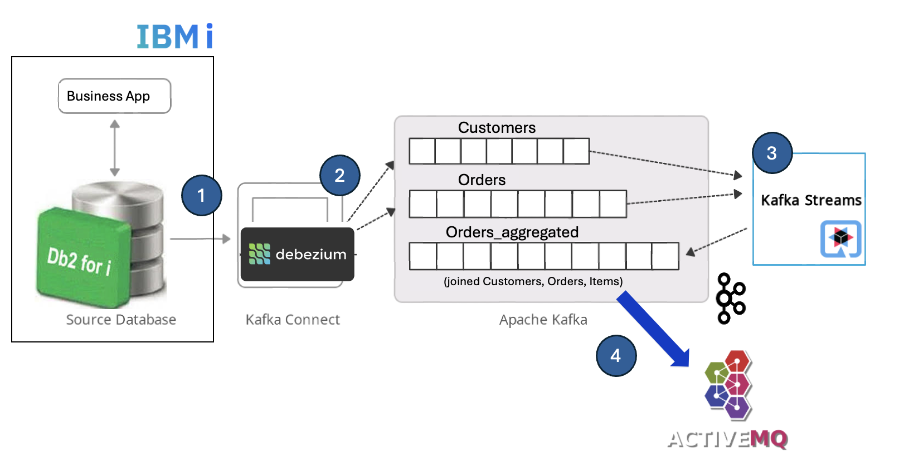

# Debezium CDC and IBM i: End-to-End CDC Pipeline

The scenario of this demonstration is the capture of order related changes from **DB2 for i**, change events that are then published on an external system, so **orders** and **customer** information can then be collected for **e-invoicing** for example.

This project describes how to set up a **Change Data Capture (CDC)** pipeline using **Debezium** with **Db2 for i**, Kafka, ksqlDB, and ActiveMQ (MQTT broker). This CDC solution is able to capture and stream in **real-time Change Events** occuring on DB2 for i, and publish these Events, .i.e. new or updated records (rows), to another consumer, a database or another system. In our particular scenario, the events are published to a **MQTT** topic so all authorized applications can consume those data.


 
## CDC or not CDC ?

First, a quick definition: "**Change data capture (CDC)** is a pattern that enables database changes to be monitored and propagated to downstream systems. It is an effective way of enabling reliable microservices integration and solving typical challenges, such as gradually extracting microservices from existing monoliths."
The **Event-driven architecture** implemented here is directly related to popular **Cloud Design Patterns** broadly used in the industry to solve many modern issues in the micro-service era. Design Patterns such as CDC, Outbox, CQRS, Event Sourcing. 

Before opting for such CDC implementation, take in consideration other alternatives that may differ in complexity, performance, reliability, and consistency model. Examples of options are: 
1) Use of a program on IBM i or externally that regularly polls the DB2 for i database and publish new records externally. Simple, but not necessarily real time.
2) DB2 triggers feeding a data queue (*DTAQ), so any consumer like an external program relying on any technology that can use native IBM i objects like data queues (java, Apache Camel) can push events to MQTT. Triggers have performance impacts, and requires cautious management on the IBM i side.
3) Use of a CDC technology, such as Debezium, that is journal-based (like other proprietary HA solutions on IBM i, but here it is free open source), to track and stream changes to another tier, that can be a database or another broker (kafka, mqtt, etc.). Debezium is a Kafka technology, where table events are published in Kafka topics hosted on a Kafka cluster before they are pushed to another component like a corporate message broker for example. This architecture is robust for real time use cases, open source based, with minimal performance and operational impact on IBM i (to be measured!). It also requires more technology than the previous options. Event/data replication is strongly consistent when tracking changes on one table. In the case of a domain event on multiple tables, it must be combined with the Outbox pattern.
4) The ultimate solution could be CDC + **[Outbox pattern](https://microservices.io/patterns/data/transactional-outbox.html)**  with Debezium. It requires the creation of an outbox domain driven table that aggregates records from several tables on the source database (here Db2 for i) instead of streaming events separately like in option 3. This pattern ensures the atomicity of the CDC operation but requires additional changes in the database and applications. The option is robust and strongly consistent. 
5) Finally, it is good to know that in addition to open source and community supported CDC solutions like Debezium, IBM CDC offering called **[IBM InfoSphere CDC Replication Engine](https://www.ibm.com/docs/en/idr/11.4.0?topic=replication-cdc-engine-db2-i)** is a robust and mature solution with many connectors available. Other vendors propose also CDC and/or journaling (log) based replication tools compatible with Db2 for i. 
Debezium CDC connector for IBM i does not support (*yet*) all data types available with DB2 for i like **BLOB** (used with JSON tables) or Geospatial ST_Point, so there are still many things to validate on a specific environment and the devil is always in the details. 

In this project, we'll mainly focus on **Debezium CDC** , that can easily be upgraded to CDC+Outbox with a few modifications ^^ 

Please reach out if any questions.

### Setup Overview
- **Run** your DB2 for i DDL and insert/update sample data.
- **Start** the CDC streaming stack with podman-compose or docker-compose
- **Create** Debezium (in) and MQTT (sink, out) Connectors via curl.
- **Generate** events on the source database & check
- In a second step (work in progress) , **Run** the ksql SQL script to create the materialized tables and aggregate events on the fly. Indeed, the business objective is to publish shipping/billing information to MQTT, and not separate table events.

### Setup in 5 steps
#### 1) Database Setup (DB2 for i)

```bash
git clone https://github.com/bmarolleau/debezium-ibmi-demo
```

**Run** the following DDL `db2i-ddl.sql` on your DB2 for i system to create the schema and tables. 

#### 2) Debezium & MQTT Kafka Connectors 

**Download & install** the latest connectors: 
1. [debezium-connector-ibmi](https://github.com/debezium/debezium-connector-ibmi) latest release on [Maven Central](https://central.sonatype.com/artifact/io.debezium/debezium-connector-ibmi) . Use for example the 3.2.1-Final jar file available [here](https://repo1.maven.org/maven2/io/debezium/debezium-connector-ibmi/3.2.1.Final/debezium-connector-ibmi-3.2.1.Final-plugin.tar.gz) then extract all jars.

2. MQTT Sink Kafka Connector. Here I used Lense.io [Stream Reactor](https://github.com/lensesio/stream-reactor) downloadable [here](https://github.com/lensesio/stream-reactor/releases) 

3. **Copy** all jar files in the plugins directory, in their respective subfolder. 

#### 3) Start Kafka, Debezium, MQTT and tools 

````
docker-compose up -d 
````
The following file podman-compose.yml runs: 
- **Kafka broker** (in KRaft mode, no zookeeper needed)
- **Kafka Connect** with Debezium+MQTT plugins loaded
- **Debezium** UI for browsing/managing DBZ connectors
- **ActiveMQ** with MQTT support
- Optionnally: ksqlDB server + CLI (optional, for event streaming join between tables/topics)

This present docker-compose.yml file was tested on MacoS with Docker, and can be adapted for podman. Please feel free to PR if any suggestions.

#### 4) Create Kafka Connect Connectors
##### Debezium DB2 for i Source Connector

**Customize** `db2i-connector.json` with your credentials, library, table names, then run 

```bash 
curl -X POST -H "Content-Type: application/json" \
  --data @db2i-connector.json \
  http://localhost:8083/connectors
  ```
##### MQTT Sink Connectors

Let's create a Sink connector for each table to capture. In fact each table is captured in a Kafka topic, then used by a Sink connector to publis a message to the appropriate MQTT topic.

**Customize** `mqtt-customers-sink.json`, `mqtt-orders-sink.json`, `mqqt-order-items-sink.json` with your credentials, mqtt broker, topic information then run the following commands:  

````bash
curl -X POST -H "Content-Type: application/json" \
  --data @mqtt-customers-sink.json \
  http://localhost:8083/connectors

curl -X POST -H "Content-Type: application/json" \
  --data @mqtt-orders-sink.json \
  http://localhost:8083/connectors

curl -X POST -H "Content-Type: application/json" \
  --data @mqtt-order-items-sink.json \
  http://localhost:8083/connectors
  ````

List the connectors using this API:
```bash
curl -X GET http://localhost:8083/connectors/
["db2i-orders-cdc","mqtt-customers-sink","mqtt-orders-sink","mqtt-order-items-sink"]% 
```
Note that you can always remove a misconfigured connector with:
```bash
curl -X DELETE http://localhost:8083/connectors/<connector-name>
```
where `<connector-name>` is the connector to delete.

**Your three tables *customers* , *orders*, and *order-items* are now captures by Debezium and the Change Events are published to a MQTT Broker !!**


#### 5) Testing the Pipeline

1) Check Kafka topics: **Open** a terminal and consume a kafka topic (use Kafka CLI)
````bash
kafka-console-consumer --bootstrap-server localhost:9092 --topic db2i.APP.CUSTOMERS   --from-beginning
````
**Adapt** with other topics like `db2i.APP.ORDERS` or `db2i.APP.ORDER_ITEMS`


2) Verify MQTT Messages: **Open** another terminal, and run mosquitto_sub (to download first) or any MQTT client:
`````bash
mosquitto_sub -h localhost -p 1883 -u admin -P password -t "mqtt/#" -v
`````
You can also subscribe to  `"mqtt/customers"` `"mqtt/orders"` or `"mqtt/order-items"` topics instead of the wildcard `"mqtt/#"`

3) Simulate database activity
**Open** a third window with your favorite database tool and **run** several Db2 for i SQL insert or update or delete statements in your table and see the resulting events in your MQTT broker. 

Below some sample SQL statements with a transaction and a few db read/writes/updates:
```sql
SET TRANSACTION ISOLATION LEVEL SERIALIZABLE ;
INSERT INTO APP.CUSTOMERS (NAME, EMAIL) VALUES ('Alice', 'alice11@example.com');
-- SELECT * FROM APP.CUSTOMERS;
UPDATE APP.CUSTOMERS SET NAME='Alice Smith' where CUSTOMER_ID=1;
INSERT INTO APP.ORDERS (CUSTOMER_ID, STATUS, TOTAL_AMOUNT) VALUES (1, 'CREATED', 120.50);
-- SELECT * FROM APP.ORDERS;
INSERT INTO APP.ORDER_ITEMS (ORDER_ID, SKU, QTY, UNIT_PRICE) VALUES(31, 'SKU-1001', 2, 50.00);
-- SELECT * FROM APP.ORDER_ITEMS;
COMMIT;
UPDATE APP.ORDERS SET STATUS='SHIPPED' WHERE ORDER_ID=31;
SELECT * FROM APP.ORDERS;
````

4) See the final result. **Congratulations!**
You should see JSON messages forwarded to the MQTT broker.


## ksqlDB Aggregations 
**draft - work in progress**

In phase 2, optionnally, we will transform raw row-level changes with ksqlDB declarative SQL, so we can stream and aggregate records on the fly before publishing them to the MQTT topic. More precisely, we will aggregate orders, customers, and items into a single business event, and publish that enriched event to MQTT.

The objective is to join streams using **Kafka Streams** and ksqlDB before publishing messages to MQTT.




````bash
podman exec -i ksqldb-cli ksql http://ksqldb-server:8088 < ./ksql/ksql-setup.sql
````
Check what is created using ksql :  
````bash
docker exec -i ksqldb-cli ksql http://ksqldb-server:8088
````

````bash
ksql> show tables;

 Table Name      | Kafka Topic     | Key Format | Value Format | Windowed 

 CUSTOMERS_TABLE | CUSTOMERS_TABLE | KAFKA      | JSON         | false    
 ORDERS_TABLE    | ORDERS_TABLE    | KAFKA      | JSON         | false    
 ORDER_AGGREGATE | ORDER_AGGREGATE | KAFKA      | JSON         | false    
 ORDER_ITEMS_AGG | ORDER_ITEMS_AGG | KAFKA      | JSON         | false    
````
````bash
ksql> show streams;

 Stream Name     | Kafka Topic          | Key Format | Value Format | Windowed 

 CUSTOMERS       | CUSTOMERS            | KAFKA      | JSON         | false    
 CUSTOMERS_RAW   | db2i.APP.CUSTOMERS   | KAFKA      | JSON         | false    
 ORDERS          | ORDERS               | KAFKA      | JSON         | false    
 ORDERS_RAW      | db2i.APP.ORDERS      | KAFKA      | JSON         | false    
 ORDER_ITEMS     | ORDER_ITEMS          | KAFKA      | JSON         | false    
 ORDER_ITEMS_RAW | db2i.APP.ORDER_ITEMS | KAFKA      | JSON         | false   

````

## Appendices: Kafka commands 

Install a Kafka client, and run the samples commands below :
1. Create topic
````
kafka-topics --create --topic test --bootstrap-server localhost:9092 --partitions 1 --replication-factor 1
````
2. Produce on topic (publish)
````
kafka-console-producer --broker-list localhost:9092 --topic test     
````
3. List topics
````
kafka-topics --list --bootstrap-server localhost:9092
````
4. Consome on a topic, here on CUSTOMER table: 
````bash
kafka-console-consumer --bootstrap-server localhost:9092 --topic db2i.ACMEAIR.CUSTOMER --from-beginning
````

## References - Useful links
- Connector: [Debezium Connector for i](https://github.com/debezium/debezium-connector-ibmi)
- Debezium project: [FAQ](https://debezium.io/documentation/faq/)
- Excellent article: [Kafka-based AI example using DayTrader](https://github.com/ThePrez/Kafka-DayTrader-AI-example/blob/main/README.md) by [ThePrez](https://github.com/ThePrez)
 - Outbox Pattern: [Debezium Outbox Example](https://github.com/debezium/debezium-examples/tree/main/outbox) 
 - Reliable Microservices Data Exchange With the Outbox Pattern: [Article](https://debezium.io/blog/2019/02/19/reliable-microservices-data-exchange-with-the-outbox-pattern/)
 - [Aggregating Change Data Capture Events based on Transactional Boundaries](https://www.decodable.co/blog/aggregating-change-data-capture-events-based-on-transactional-boundaries)
- Another consistency challenge: [Consistent Change Data Capture Across Multiple Tables](https://dzone.com/articles/consistent-change-data-capture-across-multiple-tab)